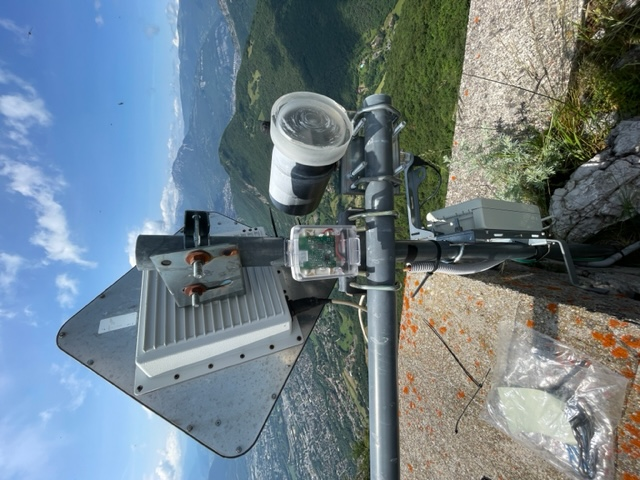
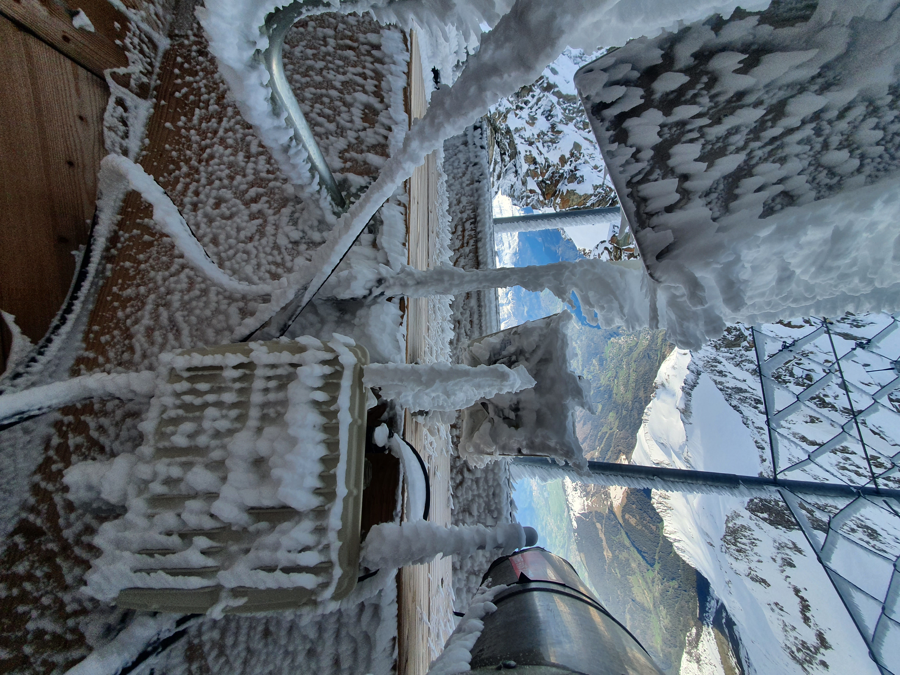
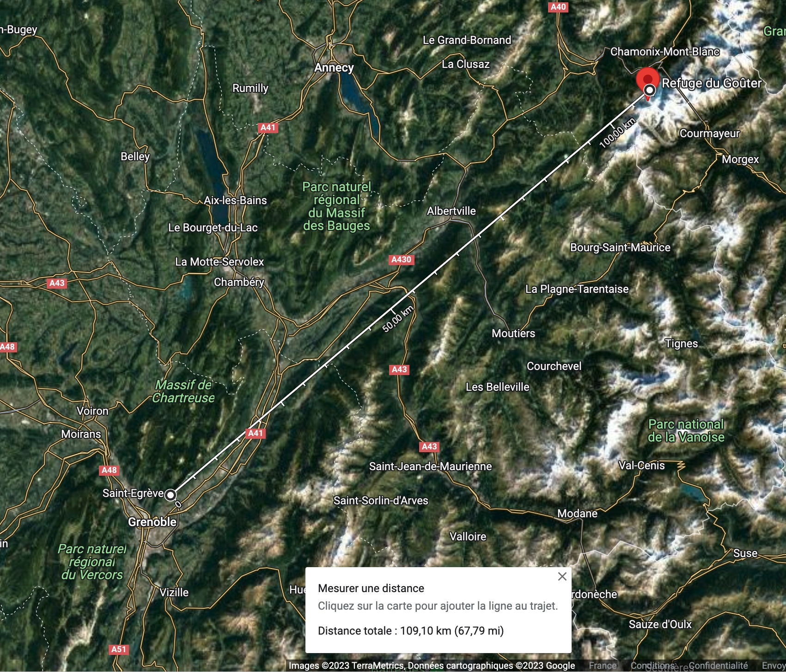
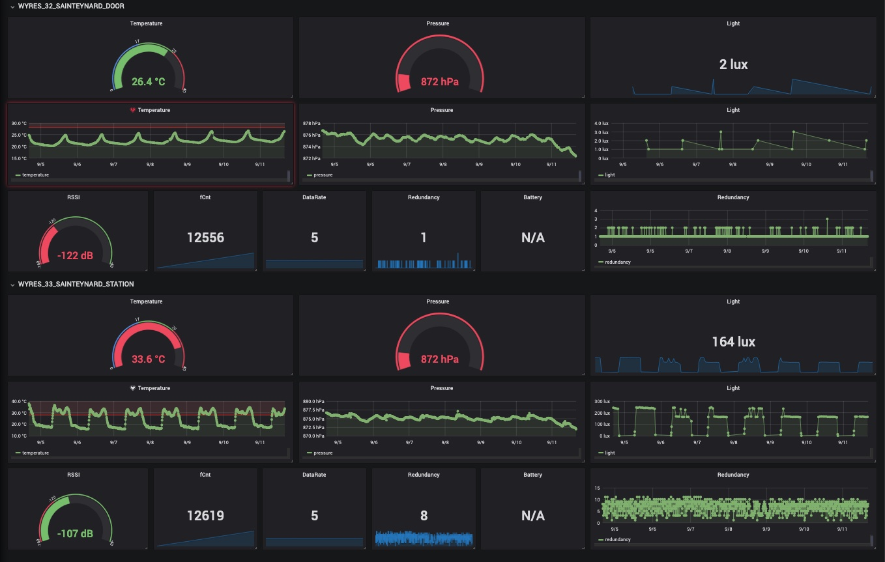

# The Saint Eynard LoRaWAN frames dataset

The directory contains the log files of frames sent by LoRaWAN endpoints installed on the top of [Fort du Saint Eynard](https://fr.wikipedia.org/wiki/Fort_du_Saint-Eynard).

The exact location is [45.23513,5.7617](https://www.openstreetmap.org/search?query=45.23513%2C5.7617#map=19/45.23513/5.76170). The GPS altitude is 1350 meters.

## LoRaWAN Emitter

Two [Wyres Base board](https://github.com/CampusIoT/RIOT-wyres/blob/main/boards/wyres_base/README.md) :
* `WYRES_32_SAINTEYNARD_DOOR`: `DevEUI`=`d1d1e80000000032`, `DevAddr`=`fc00ac77` (indoor into a technical room)
* `WYRES_33_SAINTEYNARD_STATION`: `DevEUI`=`d1d1e80000000033`, `DevAddr`=`fc00af46` (outdoor, on the station mast (see the picture))

## Dataset from CampusIoT

The endpoint's frames has been received by indoor and outdoor gateways installed in the Grenoble aera by [LIG Lab](https://www.liglab.fr/). The LNS is [Chirpstack](https://www.chirpstack.io/) v3. 

> Log files have been cleaned using the [scripts](https://gitlab.inria.fr/spelissi/wisec-2022-reproductibility/-/tree/master/code) developed by Samuel Pélissier.

> The logs is k-anonymized for the gateway EUI and name. The location of the gateways has been [geo-hashed](https://en.wikipedia.org/wiki/Geohash). Distance are computed with the GPS-acurate position of the gateways.

Coming soon in [logs/](./logs)

## Dataset from Requea

The endpoint frames has been received by a Multitech gateway installed at [Refuge du Goûter](https://en.wikipedia.org/wiki/Go%C3%BBter_Hut) [Location](https://www.openstreetmap.org/search?query=Refuge%20du%20gouter#map=19/45.85108/6.83059) Altitude: 3835 meters.

The distance is approximatly 109 kms in LoS (Line-of-Sight).

> The [Fresnel zone](https://en.wikipedia.org/wiki/Fresnel_zone) radius is 96 meters and the [free-space path loss (FSPL)](https://en.wikipedia.org/wiki/Free-space_path_loss) is 131.80 dB. For your information, FSPL is 145 dB for a [LEO satellite](https://en.wikipedia.org/wiki/Low_Earth_orbit) (500 kms) and 182 dB for a [GEO satellite](https://en.wikipedia.org/wiki/Geostationary_orbit) (35786 kms).

> LoRa Sensitivity is specified with a PER=10%, receiving 12 Byte packets, all under nominal temperature and voltage conditions. According the [Semtech SX1303 datasheet](https://semtech.file.force.com/sfc/dist/version/download/?oid=00DE0000000JelG&ids=0682R000009MnJmQAK&d=%2Fa%2F2R000000Hlli%2FTe0cB6.fNWAPfxRfoFz38R6LOTf3sLAJhD4CpS2RwFc&operationContext=DELIVERY&asPdf=true&viewId=05H3n000002u0NoEAI&dpt=), LoRa sensitivity is measured with a Semtech SX1250 front-end, an LNA with 18dB of gain and 1.5 dB of Noise Figure. The values given in the table 3-6 are : -141 dB @ ```SF12BW125``` (```DR0```) to -129 dB @ ```SF7BW125``` (```DR5```).

[CSV file](./logs)

## Citation
Didier Donsez, Pierre Dubois, Mickael Langlais, Olivier Alphand, "The Saint Eynard LoRaWAN frames dataset", 2023, DOI: TBC

## Utilities

### Jupyter Notebooks

[Notebooks](./notebooks)

### Grafana dashboards

[Dashboards to import](./grafana)

## Authors
* Didier Donsez (Université Grenoble Alpes LIG)
* Mickael Langlais (CNRS ISTERRE)
* Pierre Dubois (Requea)
* Olivier Alphand (Université Grenoble Alpes LIG)

## License
[ODbL-1.0](LICENSE.txt)

## Gallery



Credit: Mickaël Langlais



Credit: Pierre Dubois




