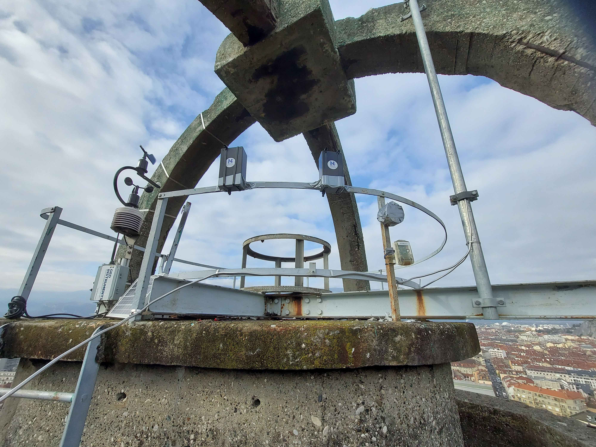
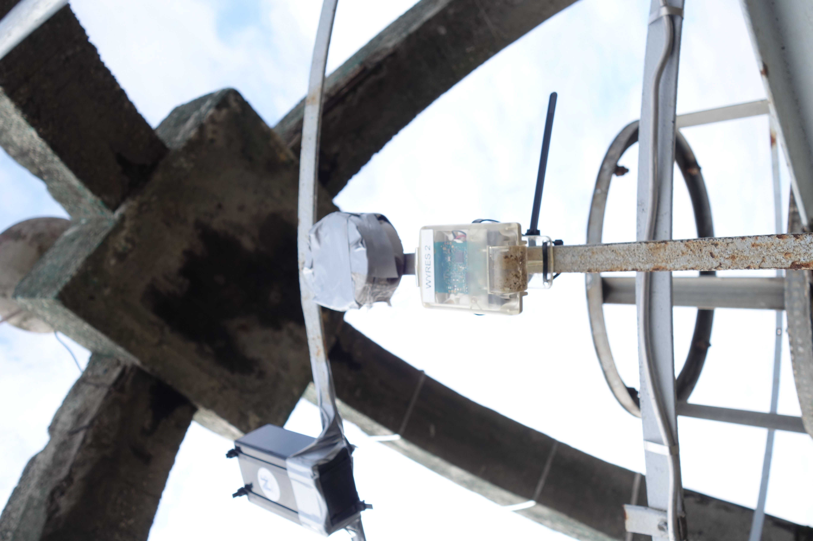
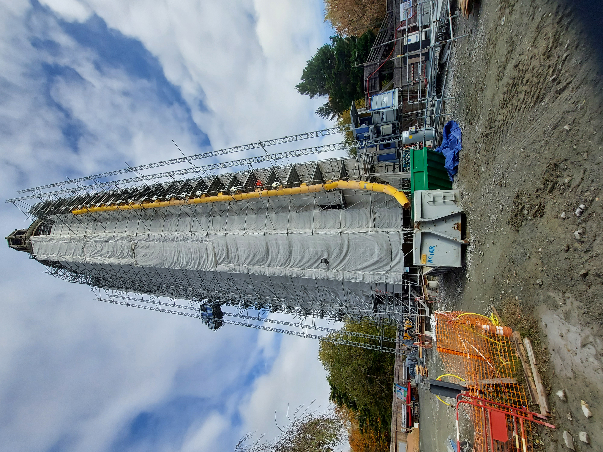

# The Tour Perret LoRaWAN frames dataset

The directory contains the log files of frames sent by [LoRaWAN endpoints](./endpoints.json) installed on the top of [Tour Perret](https://en.wikipedia.org/wiki/Perret_tower_(Grenoble)) in Grenoble, France.

> The Tour Perret, originally called La tour pour regarder les montagnes ("The tower for watching the mountains"), is an observation tower located in Grenoble, in the Paul Mistral public park. It is the first tower built in reinforced concrete in Europe. The Tour Perret is currently in restoration. You can [donate](https://www.fondation-patrimoine.org/les-projets/tour-perret-de-grenoble/79576) for helping the restoration.

The endpoints' frames has been received by indoor and outdoor gateways installed in the Grenoble aera by [LIG Lab](https://www.liglab.fr/). The LNS is [Chirpstack](https://www.chirpstack.io/) v3.

Keywords: LoRaWAN, LPWAN, LoRa, Internet of Things, Sensor networks

## Gateways

Brands and models of the [indoor and outdoor gateways](https://campusiot.github.io/images/gallery.html) are : Multitech (MTCDTIP2, MTCDTIP TDOA, MTCAP), Kerlink (Wirnet, iStation, Femto), RAK Wireless (RAK5146), Mikrotik (LAP8), Strataggem (ecoSignal).

## Endpoints

* 4x [Elsys EMS](https://www.elsys.se/en/lora-ems/) 
* 4x [Wyres Base board](https://github.com/CampusIoT/RIOT-wyres/blob/main/boards/wyres_base/README.md) v2 revC (SX1272, RF switch Skynet new)

The [endpoints](endpoints.json) are installed on four sides (SWW, SSE, NEE, NNW) of the top of the tower (into IP55 enclosures for Elsys EMS) and inside the tower.

Seven endpoints (3x [Elsys EMS](https://www.elsys.se/en/lora-ems/) and 4x [Wyres Base board](https://github.com/CampusIoT/RIOT-wyres/blob/main/boards/wyres_base/README.md)) are registered on [Chirpstack](https://www.chirpstack.io/) v3 LNS with as OTAA Class A endpoint. ADR is enabled.

One endpoint ([Elsys EMS](https://www.elsys.se/en/lora-ems/)) is registered on [Helium LoRaWAN network](https://www.helium.com/lorawan) with as OTAA Class A endpoint. ADR is enabled.

## Dataset

The `tourperret.ndjson.gz`  file contains a dataset of 421937 messages received between 2021-06-25 and 2023-06-23 (2 years). The archive file is available on the [PerSCiDO plateform](https://perscido.univ-grenoble-alpes.fr/datasets/DS395).

The `tourperret-2.ndjson.gz` file contains a dataset of 443129 messages received between 2023-06-23 and 2024-10-08 (1 year 4 months). This log file contains 3 new [endpoints Wyres](./endpoints.json) installed as of October 5, 2023 : `d1d1e80000000055` (DevAddr: `fc00ae69`), `d1d1e80000000056`  (DevAddr: `fc00af97`) , `d1d1e80000000057` (DevAddr: `fc00afb7`).


The log files are compressed [ndjson](http://ndjson.org/) files (aka one JSON object per line).

The fields prefixed by `_` are calculated and  added to the dataset sent by the LNS.

* `applicationName` : the brand and the model of the endpoint
* `devEUI` : the devEUI of the endpoint (hashed)
* `_date` : the archive date (human-readable string)
* `_timestamp` : the millisecond epoch of the archive time
* `data` : the hex-formatted frame payload (plain)
* `object` : the frame payload decoded using the endpoint decoder
* `_devLocation` : the static location of the endpoint
* `txInfo` : the LoRaWAN transmission parameters 
* `rxInfo` : the array of the radio parameters of the duplicated receptions by the gateways
* `rxInfo[]._distance` : the set of distances between the endpoint and the gateway 
* `rxInfo[]._distance._timeOfEmission` : time of emission (in nanosecond) since the `time` of the reception by the gateway.  The `time` field is sometime missing in indoor gateways.

> The ```object``` field contains the measurement of the weather conditions at the top of the tower. For Elsys EMS endpoint, the ```accMotion``` field counts the shock inside the steel structure triggered by gusts of wind. The weather conditions can be correlated with weather datas from services such as OpenWeatherMap.

> Several fields are k-anonymized for the sake of privacy. The location of the gateways has been [geo-hashed](https://en.wikipedia.org/wiki/Geohash). The precision is 6 (±0.61 km (0.38 mi; 610 m)). Distance are computed with the GPS-acurate position of the gateways or from the static position set by the gateway installation. The gateway installation can be erroneous.

> Distances are computed with the original locations of the emitter and the receiver.

> Log files have been cleaned and obfuscated using the [scripts](https://gitlab.inria.fr/spelissi/wisec-2022-reproductibility/-/tree/master/code) developed by [Samuel Pélissier](https://orcid.org/0000-0002-3554-2585).

## Bonus dataset

The [NDJSON logfile `ems-tourperret-A81758FFFE04B1C1.ndjson.gz`](./ems-tourperret-A81758FFFE04B1C1.ndjson.gz) contains 12614 frames sent between 2023-01-04 to 2023-09-28 by the endpoint `A81758FFFE04B1C1` ([Elsys EMS](https://www.elsys.se/en/lora-ems/)) registered on [Helium LoRaWAN network](https://www.helium.com/lorawan).

The [NDJSON logfile `ems-tourperret-A81758FFFE04B1C1-2.ndjson.gz`](./ems-tourperret-A81758FFFE04B1C1-2.ndjson.gz) contains 20351 frames sent between 2023-06-23 and 2024-07-11 by the endpoint `A81758FFFE04B1C1` ([Elsys EMS](https://www.elsys.se/en/lora-ems/)) registered on [Helium LoRaWAN network](https://www.helium.com/lorawan).

> Several fields (hotspot names) are k-anonymized for the sake of privacy. The location of the hotspots has been [geo-hashed](https://en.wikipedia.org/wiki/Geohash). The precision is 6 (±0.61 km (0.38 mi; 610 m)). Distance are computed with the GPS-acurate position of the hotspots or from the static position set by the hotspot installation. The hotspot installation can be erroneous.

> Distances are computed with the original locations of the emitter and the receiver.

## Battery change log

Endpoints are powered by LS14500/ER14505 3.6V 2600mAh Li-SOCl2 battery (one per endpoint).

* 2023-03-15: battery change for `a81758fffe04b1c2` 
* 2024-11-13: battery change for `d1d1e80000000055`, `d1d1e80000000057`, `eb55ac951504d28d`, `a81758fffe04b1bf, `a81758fffe04b1c1`.

## Citation

Didier Donsez, Olivier Alphand, Nicolas Albarel, "The Tour Perret LoRaWAN frames dataset", 2023, https://doi.org/10.18709/perscido.2023.06.ds395 [HAL](https://hal.science/hal-04737487)

## Authors

* Didier Donsez (Université Grenoble Alpes LIG)
* Olivier Alphand (Université Grenoble Alpes LIG)
* Nicolas Albarel (ANS Innovation)

## Thanks

Special thanks to Valerie and Dorian, Direction Urbanisme et Aménagement de la ville de Grenoble.

## License
[ODbL-1.0](LICENSE.txt)

## Utilities

```bash
gunzip -c tourperret.ndjson.gz | wc -l
gunzip -c tourperret.ndjson.gz | jq . | more
gunzip -c tourperret-2.log.gz | wc -l
gunzip -c tourperret-2.log.gz | jq . | more
```

### Grafana dashboards

[Dashboards to import](./grafana)

### Jupyter notebooks

[Notebooks for playing with datasets](./notebooks)

## Gallery

Credit: Didier Donsez, Nicolas Albarel, Nicolas Palix








