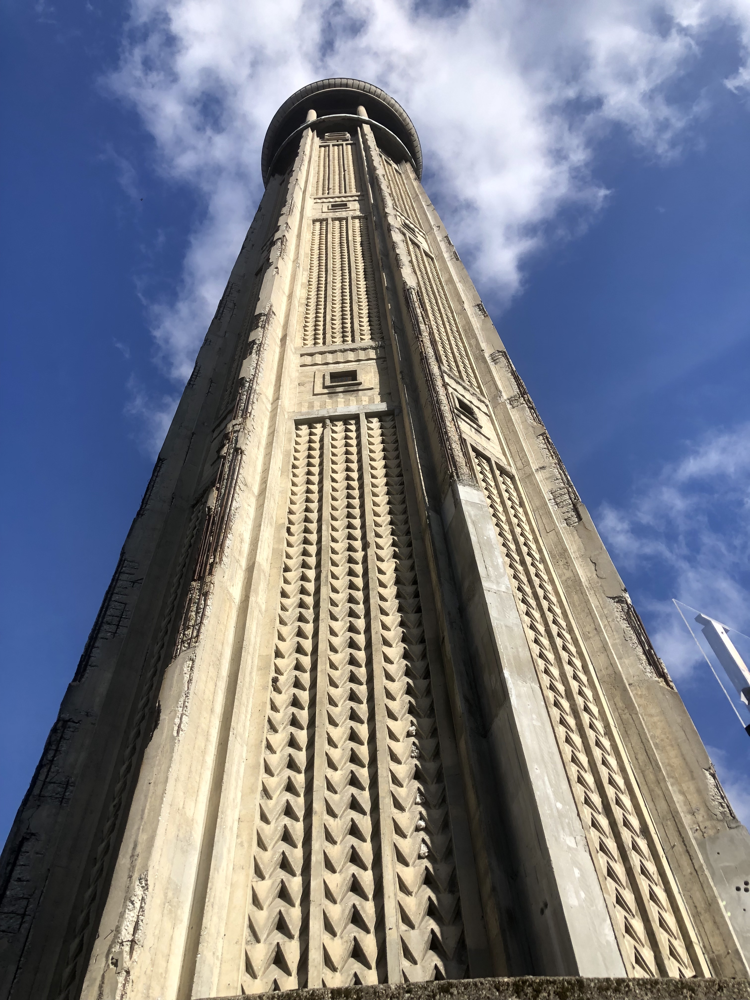
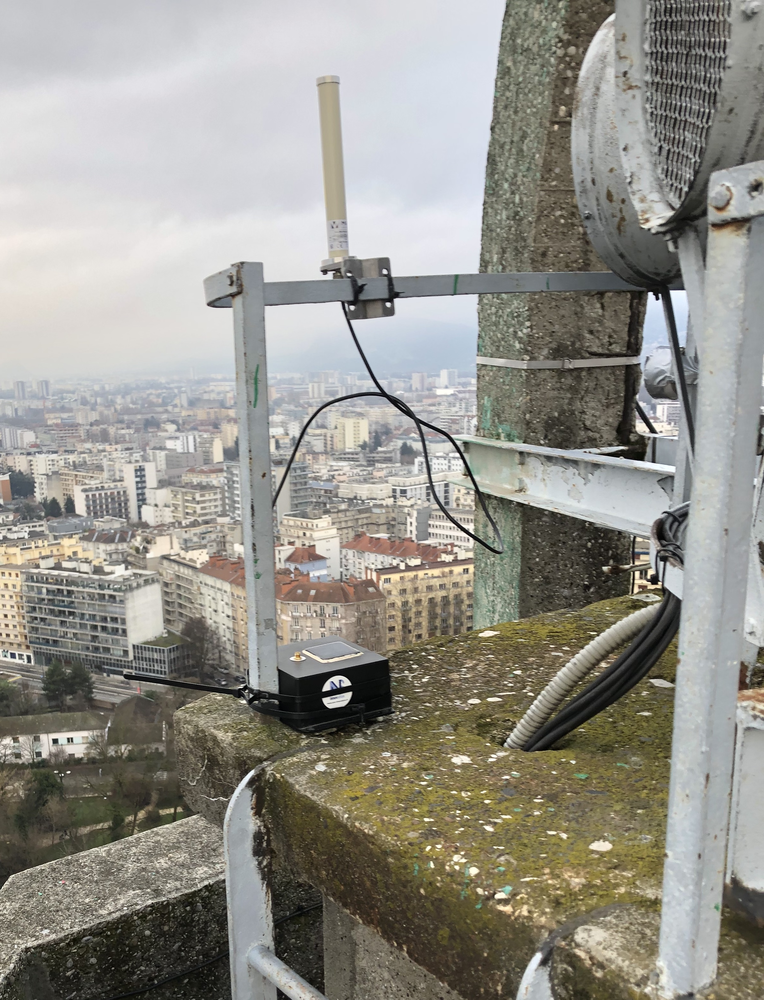

# The Tour Perret LoRaWAN 2G4 frames dataset

The dataset contains the log files of 1193638 frames sent by A LoRa 2.4 GHz endpoint installed on the top of [Tour Perret](https://en.wikipedia.org/wiki/Perret_tower_(Grenoble)) in Grenoble, France.

The goal of this dataset is the long-time study of performance and Wifi coexistence of LoRa 2.4 GHz communications in an urban context.

> The Tour Perret, originally called La tour pour regarder les montagnes ("The tower for watching the mountains"), is an observation tower located in Grenoble, in the Paul Mistral public park. It is the first tower built in reinforced concrete in Europe.

The endpoint's frames has been received by indoor and outdoor 2.4 GHz gateways installed in the Grenoble area by [ANS Innovation](https://www.ans-innovation.fr/) and  [LIG Lab](https://www.liglab.fr/).

## LoRa 2.4 GHz Endpoint

The endpoint `fc00ac20` located on the top of the Tour Perret is an [Olimexino-STM32](https://www.olimex.com/Products/Duino/STM32/OLIMEXINO-STM32/open-source-hardware) board with a STM32F103RBT6 microcontroller and a [Lambda80](https://www.farnell.com/datasheets/2720464.pdf) SPI module (SX1280). 
The endpoint is powered by a [LiPo battery 4400mAh](https://www.olimex.com/Products/Power/Lipo-battery/BATTERY-LIPO4400mAh/).

The antenna is a omnidiectional [Mars MA-DBO2458-6NF1](https://www.mhzshop.com/pdf/en/2377-Datasheet.pdf) with a gain of 5 dBi.

The firmware is a bare-metal firmware developed with STM32Cube IDE.

The endpoint sends LoRaWAN frames periodically, see the datasets description for the details. 


## LoRa 2.4 GHz Gateway

The gateway is the Semtech [LoRa® Reference Design for 2.4GHz Gateway Based on SX1280 (SX1280ZXXXXGW1)](https://www.semtech.fr/products/wireless-rf/lora-core/sx1280zxxxxgw1).

The SX1280ZXXXXGW1 gateway had 3 RX channels and 1 single-SF per RX channel.

The outdoor antenna model is a omnidiectional [Mars MA-DBO2458-6NF1](https://www.mhzshop.com/pdf/en/2377-Datasheet.pdf) with a gain of 5 dBi.

The indoor antenna is a low-cost omnidiectional 2.4GHz antenna (https://www.amazon.fr/gp/product/B01E564B8G/) with a gain of 3 dBi.

The gateway is registered on the CampusIoT's LoRaWAN network operated with [Chirpstack v3 LNS](https://www.chirpstack.io/).

##  Locations and Distances

The endpoint is installed in outdoor on the top of Tour Perret (SSE side) at ~90 meters above the ground.

The first location of the SX1280ZXXXXGW1 gateway (aka `gateway_1`) was installed outside a building at ~10 meters high.

The second location of the SX1280ZXXXXGW1 gateway (aka `gateway_2`) was installed inside a house at ~1 meter high.

Summary
* `perret` (outdoor, ~90m from the ground) to `gateway_1` (outdoor, ~10m from the ground). Distance : 950m NLOS
* `perret` (outdoor, ~90m from the ground) to `gateway_2` (indoor, ~5m from the ground). Distance : 850m NLOS

## Dataset

The archive file is available on the [PerSCiDO plateform](https://commons.datacite.org/doi.org?query=The+Tour+Perret+LoRa+2G4+frames+dataset).

The files contain a dataset of 1193638 LoRaWAN messages received between January 2022 and June 2023. 

* `dataset-perret-multichan_gateway_1.log` contains reception metadata on default LoRaWAN channels (2403000000, 2425000000, 2479000000) with SF12 only between 2022-01-20 and 2022-03-12 (171694 received messages / 174762 transmited messages).
* `dataset-perret-multichan_gateway_2.log` contains reception metadata on default LoRaWAN channels (2403000000, 2425000000, 2479000000) with SF12 only between 2022-03-24 and 2022-05-24 (310652 received messages / 425682 transmited messages).
* `dataset-perret-multisf_gateway_2.log` contains reception metadata of frame on channel 2479000000 MHz only, but with SF12/11/10 between 2023-03-15 and 2023-06-27 (711292 received messages / 817572 transmited messages).


For each `fcount`, multiple versions of the transmission are done. You can check the test number or the parameters (`freq`/`length`/`preamble`/`cr`/`sf`)

For instance:

```json
{"addr": "fc00ac20", "rssi": -101, "snr": -8, "fcount": 1, "volt": 4106, "test": 1, "timestamp": "2023-03-15T08:18:24+00:00", "freq": 2479000000, "length": 15, "preamble": 8, "cr": "4/5", "sf": 12, "bw": 800}
{"addr": "fc00ac20", "rssi": -102, "snr": -6, "fcount": 1, "volt": 4103, "test": 2, "timestamp": "2023-03-15T08:18:25+00:00", "freq": 2479000000, "length": 15, "preamble": 8, "cr": "4/5", "sf": 11, "bw": 800}
{"addr": "fc00ac20", "rssi": -101, "snr": -6, "fcount": 1, "volt": 4104, "test": 3, "timestamp": "2023-03-15T08:18:27+00:00", "freq": 2479000000, "length": 15, "preamble": 8, "cr": "4/5", "sf": 10, "bw": 800}
```

> Log files have been cleaned using the [scripts](https://gitlab.inria.fr/spelissi/wisec-2022-reproductibility/-/tree/master/code) developed by [Samuel Pélissier](https://orcid.org/0000-0002-3554-2585).

> The weather conditions can be correlated with weather datas from online services such as [OpenWeatherMap](https://openweathermap.org/city/3014728).

## Citation

Nicolas Albarel, Didier Donsez, Olivier Alphand, "The Tour Perret LoRa 2G4 frames dataset", 2023, [doi:10.18709/perscido.2023.07.ds397](https://www.doi.org/10.18709/perscido.2023.07.ds397)

## Authors

* Nicolas Albarel ([ANS Innovation](https://www.ans-innovation.fr/))
* Didier Donsez (Université Grenoble Alpes, [LIG Lab](https://www.liglab.fr/))
* Olivier Alphand (Université Grenoble Alpes, [LIG Lab](https://www.liglab.fr/))

## Thanks

Special thanks to Valerie and Dorian, Direction Urbanisme et Aménagement de la ville de Grenoble.

## License
* [ODbL-1.0](LICENSE.txt) for the dataset

## Notebooks

Jupyter notebooks for analysing the dataset are into the repository : https://github.com/CampusIoT/datasets/tree/main/TourPerret2G4/notebooks

## Gallery

Credit: Nicolas Albarel, Didier Donsez






## References
* Nicolas Albarel, Olivier Alphand, Didier Donsez, [Retour d’expérience sur une année de communication in-situ avec la modulation LoRa 2.4GHz](https://gdr-rsd.fr/wp-content/uploads/2023/01/Session_1_-_DidierDonsez_-_REX_LoRa_2.4GHz__GDR_RSD.pdf), [Journées non thématiques RSD](https://gdr-rsd.fr/journees2023/), Lyon, 26-27 janvier 2023.
* [Semtech Physical Layer Proposal 2.4GHz](https://lora-developers.semtech.com/documentation/tech-papers-and-guides/physical-layer-proposal-2.4ghz/)
* [LoRa® 2.4GHz 3 Channels Single SF Reference Design
Performance Report](https://semtech.my.salesforce.com/sfc/p/#E0000000JelG/a/2R0000001PqL/cdoTFmqf7LlgF4NVLAQcC6y2hjPu25INIHdaXw3bpR4), Rev. 1.0 Semtech, Apr. 2020
